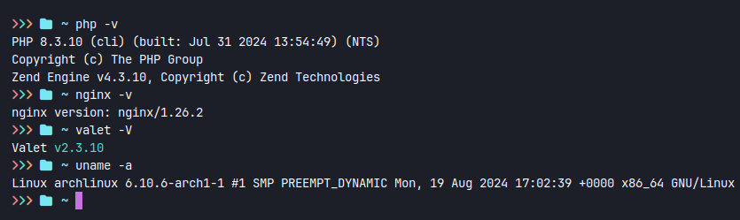

### Pokemon List (Web Static)

Pada project kali ini saya menggunakan html, php dan tailwindcss (framework css).
Data pokemon ada di `public/pokemon.json` dengan jumlah data 898.

### Info tambahan

Versi `PHP` dan web server `Nginx`

### Author

Dian Ronaldo Kereh